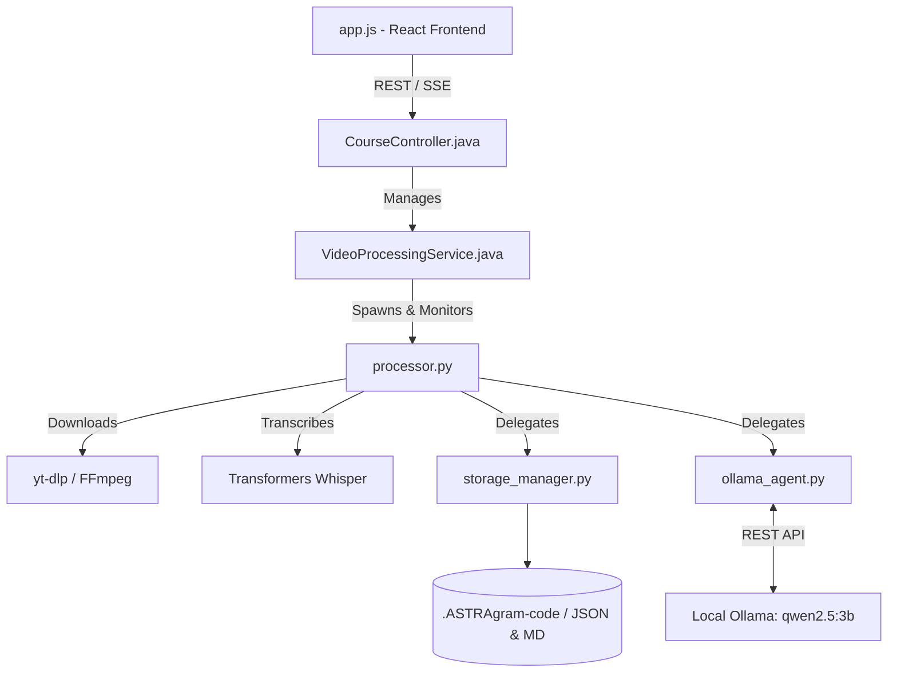

# ASTRAgram - AI IDE Context & Architecture File

> **FOR AI ASSISTANTS**: Read this file FIRST. It contains a high-density, low-token overview of the ASTRAgram project architecture, data flows, and critical historical bug fixes. Do NOT revert the "lifetime fixes" documented below.

## 1. System Architecture & Data Flow

ASTRAgram is a hybrid Java/Python/React application that converts YouTube videos into interactive educational courses.



### Core Components Summary
*   **`backend-java/src/main/resources/static/app.js`**: React frontend. Handles SSE streams (`PROGRESS:`, `COURSE_INIT:`), rendering, and triggering Ollama restarts.
*   **`backend-java/src/main/java/.../CourseController.java`**: Exposes `/api/course/process` (SSE), `/restart-ollama`, `/api/course/report-quiz-question`.
*   **`backend-java/src/main/java/.../VideoProcessingService.java`**: Orchestrates `processor.py` via `ProcessBuilder`. Handles process destruction on SSE disconnects and prevents threading deadlocks.
*   **`backend-java/processor.py`**: The heavy lifter. Chunks video, runs transcription, passes text to Ollama for summarization/quizzes. Outputs SSE events to stdout.
*   **`backend-java/ollama_agent.py`**: Interface for local Ollama. Contains robust Regex-based JSON extractors to handle "chatty" LLMs.
*   **`backend-java/storage_manager.py`**: Handles local file persistence (both `.json` and `.md` formats).
*   **`backend-java/report_quiz_question.py`**: Micro-script to delete and regenerate erroneous quiz questions. Uses fail-fast timeout (45s).

---

## 2. Critical "Lifetime" Bug Fixes (DO NOT REVERT)

The following architectural vulnerabilities were resolved. Future code modifications MUST respect these paradigms:

### A. OS Pipe Deadlocks (Java)
*   **Bug**: Java read Python's stdout synchronously in `CourseController.java` and `VideoProcessingService.java`. Python's stderr (FFMPEG logs, Python errors) filled the OS pipe buffer, permanently freezing both Java and Python.
*   **Fix**: Java spawns a dedicated background `Thread` to asynchronously drain `process.getErrorStream()`. **Constraint**: Always read stderr on a separate thread when using `ProcessBuilder`.

### B. Tomcat Worker Exhaustion (Java / HTTP)
*   **Bug**: The `/report-quiz-question` endpoint was synchronous. If Ollama hung, the Python script waited 600s, permanently blocking the Tomcat HTTP worker thread.
*   **Fix**: Enforced a "Fail-Fast" architecture. Reduced `timeout=45` in `report_quiz_question.py` so Tomcat threads are freed if AI generation hangs.

### C. Zombie AI Processes (Java)
*   **Bug**: If the client closed the browser (`app.js`), the SSE connection dropped but the background Python script (`processor.py`) ran indefinitely, leaking CPU/GPU.
*   **Fix**: `VideoProcessingService.java` attaches `process.destroy()` to `emitter.onCompletion`, `onTimeout`, and `onError` hooks. **Constraint**: Do not remove process lifecycle hooks from the SSE Emitter.

### D. The "Zombie Quiz" Persistence Bug (Python)
*   **Bug**: When the user reported an issue on a quiz question, `report_quiz_question.py` removed it from the local `episode_quiz.json` file but forgot to update the master `metadata.json` file. When the user refreshed the dashboard, the old deleted question came back from the dead!
*   **Fix**: Bound a metadata-sync operation into `report_quiz_question.py` so the global database permanently accepts the deletion and replacement.

### E. Dashboard UI Duplication Bug (React)
*   **Bug**: Building a course from a cached URL caused `app.js` to unconditionally append the course to the UI list, resulting in the same course duplicating on the screen.
*   **Fix**: Added a state checker (`findIndex`) in `course_init` to overwrite existing state entries instead of appending duplicates.

### F. 0-Byte Cache Corruption (Python)
*   **Bug**: A killed process left 0-byte `.mp4` or `.wav` files. Subsequent runs saw `os.path.exists()` = true, skipped downloading, and crashed.
*   **Fix**: `processor.py` uses a custom `is_valid_media_file()` function that checks `os.path.getsize() > min_bytes`. It deletes corrupted stubs.

### G. JSON Cache Corruption Crashes (Python)
*   **Bug**: If a crash happened exactly while `storage_manager.py` was saving `metadata.json` or `episode_1_quiz.json`, the file was corrupted. The next time the user clicked "Build", the JSON parser would throw a `JSONDecodeError` and crash the entire backend instantly.
*   **Fix**: Implemented strict `try/except` blocks inside `storage_manager.load_metadata` and `load_quiz`. It now gracefully treats corrupted files as "missing" so the system cleanly overwrites them instead of crashing.

### H. YouTube Video Truncation & Format Crashes (Python)
*   **Bug 1**: `yt-dlp` requested an exact format (`bestvideo[ext=mp4]+bestaudio[ext=m4a]/mp4`). If YouTube provided a WebM or merged 4K stream, the script crashed.
*   **Fix 1**: Provided fallback rules (`bestvideo+bestaudio/best`) and commanded `yt-dlp` to use `ffmpeg` to force-merge weird formats into `.mp4`.
*   **Bug 2**: If the `yt-dlp` metadata API was rate-limited by YouTube, `processor.py` fell back to guessing the video was 6 minutes long (`video_duration = 360`). If the video was actually 2 hours long, the chunker permanently truncated and threw away everything after 6 minutes.
*   **Fix 2**: After the file is downloaded, `processor.py` ignores the YouTube metadata completely and physically probes the MP4 file using `ffmpeg` (`get_video_duration`) to get the 100% accurate file length, preventing any accidental truncation.

### I. 0-Episode Transcript Generation Bugs (Python)
*   **Bug**: If the YouTube Transcript API returned a transcript object but the actual text was empty, the `build_topic_segments` script generated a chunk array of length zero. The processing loop skipped entirely, generating a broken course with exactly zero episodes.
*   **Fix**: Added a safety check. If `segments` comes back empty, the script gracefully triggers `needs_whisper = True` to force the AI Whisper engine to do it. Also added a `max(1, total_chunks)` math safety net to guarantee all videos yield at least 1 episode.

### J. The "10-Minute Blank Loop" Bug (Python)
*   **Bug**: If the Ollama AI engine crashed mid-build (e.g. during Segment 1), `processor.py` would try to wait 60s for it to restart. If it failed to restart, the script would *give up on Segment 1, create a placeholder quiz, and then proceed to Segment 2!* This created an agonizing 10-minute loop where the user watched the loading bar slowly process 10 segments, ultimately delivering a completely blank course where every single quiz failed.
*   **Fix**: Modified the 60s recovery loop in `processor.py` to be a "Hard Stop." If Ollama does not successfully restart within 60s, the entire build is instantly aborted. An error is pushed to the UI instructing the user to click the "Restart Ollama" button, preventing the horrific 10-minute blank loop.

### K. LLM JSON Parsing Crashes (Python)
*   **Bug**: `ollama_agent.py` and `report_quiz_question.py` crashed when the LLM output conversational text around JSON (e.g., "Here is your quiz: ```json [...]```").
*   **Fix**: Implemented `extract_json_array(text)` using aggressive RegEx (`\[\s*\{.*?\}\s*\]`) to extract JSON regardless of surrounding markdown. Applied globally.

### L. Long Video Context Truncation (Python)
*   **Bug**: Transcripts for >1hr videos were truncated due to Ollama token limits, causing later segments to lose context.
*   **Fix**: Implemented a **Sliding Context Queue** / **Summary Memory**. `processor.py` concatenates previously generated segment summaries and feeds them as context for the next segment, bypassing raw transcript length limits.

---

## 3. Development Guidelines

1.  **Adding New SSE Events**: 
    *   Python: `print("EVENT_NAME:payload", flush=True)`
    *   Java: Parse `if (line.startsWith("EVENT_NAME:"))` in `VideoProcessingService.java` and send via `emitter.send()`.
    *   React: Listen in `app.js` using `eventSource.addEventListener('event_name', ...)`
2.  **Ollama Models**: Always use `qwen2.5:3b-instruct` (configured in `ollama_agent.py`) as the baseline. Wait aggressively if Ollama goes offline (handled via 60s sleep loop in `processor.py`).
3.  **Data Storage**: Quizzes must be stored simultaneously in `.json` (for the frontend React map) and `.md` (for the user's permanent file storage) using `storage_manager.py`.
